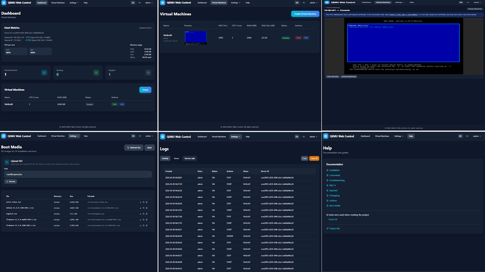

# QEMU Web Control

Современный веб-интерфейс для управления виртуальными машинами QEMU, построенный на Laravel 11, Docker и Tailwind CSS.



## Возможности

- 🖥️ **Управление виртуальными машинами**: Создание, запуск, остановка, перезапуск и удаление QEMU ВМ
- 🔐 **Аутентификация и авторизация**: Управление доступом на основе ролей (Администратор/Пользователь)
- 🌍 **Мультиязычность**: Поддержка английского и русского языков
- 🎨 **Современный темный интерфейс**: Красивая темная тема с Tailwind CSS
- 📊 **Журнал действий**: Полный аудит всех действий пользователей
- 🔒 **Поддержка SSL**: HTTPS с самоподписанными или Let's Encrypt сертификатами
- 🐳 **Интеграция с Docker**: Простое развертывание с Docker Compose
- 📦 **Хранение в MariaDB**: Надежная база данных для конфигурации

## Требования

- Linux хост (протестировано на Debian/Ubuntu, Orange Pi RV2)
- Docker и Docker Compose (будут установлены автоматически, если отсутствуют)
- QEMU/KVM установленные на хост-системе

**Примечание для RISC-V**: Если вы используете RISC-V архитектуру (Orange Pi, VisionFive и др.), см. [RISCV.RU.md](docs/RU/RISCV.RU.md) для специальных инструкций.

## Быстрая установка

```bash
chmod +x install.sh
./install.sh
```

**Важно:** На RISC-V (Orange Pi) установка займет 20-30 минут. Запаситесь терпением! ☕

Установщик выполнит:
1. Проверку и установку Docker при необходимости
2. Проверку Apache2 и предложит настроить как reverse proxy (если установлен)
3. Настройку базы данных (Docker или внешняя)
4. Создание базы данных если её нет
5. Настройку окружения
6. Генерацию SSL сертификатов
7. Сборку и запуск контейнеров
8. Запуск миграций и сидеров

### Установка на русском языке

```bash
./install.sh --lang ru
```

**Интерактивный ввод:**
- Значения по умолчанию показаны в `[квадратных скобках]`
- Просто нажмите Enter для использования значения по умолчанию
- См. [INSTALL-EXAMPLE.RU.md](docs/RU/INSTALL-EXAMPLE.RU.md) / [INSTALL-EXAMPLE.EN.md](docs/EN/INSTALL-EXAMPLE.EN.md) для примеров установки

### Если что-то пошло не так

Не паникуйте! Установка на RISC-V может быть непростой.

**Для RISC-V (Orange Pi, VisionFive):**
```bash
# Полная диагностика с детальным логом
./scripts/full-diagnostic.sh
# Создаст файл diagnostic-YYYYMMDD-HHMMSS.log

# Быстрое исправление после неудачной установки
./scripts/quick-fix-riscv.sh

# Если проблема с Node.js (ERROR 404)
./scripts/fix-nodejs-riscv.sh

# Если проблема с MariaDB (no matching manifest)
./scripts/fix-database-riscv.sh

# Если проблема с базой данных
./scripts/setup-database.sh
```

См. [TROUBLESHOOTING.EN.md](docs/EN/TROUBLESHOOTING.EN.md) / [TROUBLESHOOTING.RU.md](docs/RU/TROUBLESHOOTING.RU.md) и [RISCV.RU.md](docs/RU/RISCV.RU.md) для подробностей.

## Скрипты управления

```bash
./start.sh      # Запустить приложение
./stop.sh       # Остановить приложение
./restart.sh    # Перезапустить приложение
./uninstall.sh  # Удалить приложение
```

Все скрипты поддерживают параметр `--lang ru` или `--lang en`.

### Примеры

```bash
# Запуск с русским языком
./start.sh --lang ru

# Полное удаление включая файлы проекта
./uninstall.sh --clean --lang ru
```

## Доступ по умолчанию

После установки:
- **Прямой доступ**: http://localhost:8080 или https://localhost:8443 (если порты заняты, будут предложены другие)
- **Через Apache2** (если настроен): http://localhost или https://localhost
- **Администратор**: admin / admin

**Примечание**: Если вы настроили Apache2 как reverse proxy, используйте стандартные порты 80/443.

## Структура проекта

```
QemuWebControl/
├── app/
│   ├── Http/
│   │   ├── Controllers/       # Контроллеры
│   │   └── Middleware/        # Middleware
│   ├── Models/                # Модели Eloquent
│   ├── Policies/              # Политики авторизации
│   └── Services/              # Бизнес-логика
├── database/
│   ├── migrations/            # Миграции БД
│   └── seeders/               # Сидеры
├── docker/
│   ├── nginx/                 # Конфигурация Nginx
│   └── php/                   # Конфигурация PHP-FPM
├── lang/
│   ├── en/                    # Английская локализация
│   └── ru/                    # Русская локализация
├── resources/
│   ├── css/                   # Стили
│   ├── js/                    # JavaScript
│   └── views/                 # Blade шаблоны
├── routes/                    # Маршруты
├── docker-compose.yml         # Docker Compose конфигурация
├── install.sh                 # Скрипт установки
├── start.sh                   # Скрипт запуска
├── stop.sh                    # Скрипт остановки
├── restart.sh                 # Скрипт перезапуска
└── uninstall.sh               # Скрипт удаления
```

## Apache2 Reverse Proxy

Если у вас установлен Apache2, скрипт установки предложит настроить его как reverse proxy.

Преимущества использования Apache2:
- Стандартные порты 80/443
- Let's Encrypt SSL сертификаты
- Дополнительная безопасность
- Кэширование и сжатие

Подробнее: [APACHE.RU.md](docs/RU/APACHE.RU.md) / [APACHE.EN.md](docs/EN/APACHE.EN.md)

## Конфигурация

### Переменные окружения (.env)

Основные параметры:

```env
APP_NAME="QEMU Web Control"
APP_URL=http://localhost
APP_PORT=8080
APP_SSL_PORT=8443

DB_CONNECTION=mysql
DB_HOST=db
DB_PORT=3306
DB_DATABASE=qemu_control
DB_USERNAME=qemu_user
DB_PASSWORD=qemu_password

QEMU_BIN_PATH=/usr/bin/qemu-system-x86_64
QEMU_IMG_PATH=/usr/bin/qemu-img
QEMU_VM_STORAGE=/var/lib/qemu/vms
QEMU_ISO_STORAGE=/var/lib/qemu/iso
QEMU_ISO_VOLUME=/var/lib/qemu/iso
```

### Настройка QEMU

По умолчанию приложение ожидает, что QEMU установлен в стандартных путях:
- Бинарник: `/usr/bin/qemu-system-x86_64`
- qemu-img: `/usr/bin/qemu-img`

Хранилища (создаются автоматически при установке):
- ВМ диски: `/var/qemu/VM`
- ISO образы: `/var/lib/qemu/iso` или `/srv/iso`

Для CD-ROM укажите путь к ISO при создании/редактировании ВМ, например: `/var/lib/qemu/iso/ubuntu.iso` или `/srv/iso/ubuntu.iso`. Переменная `QEMU_ISO_VOLUME` в `.env` задаёт кастомный путь к ISO. ISO можно загружать через веб-интерфейс (Настройки → Загрузочные носители, до 10 ГБ) — см. [BOOT-MEDIA.RU.md](docs/RU/BOOT-MEDIA.RU.md).

## Использование

### Создание виртуальной машины

1. Войдите в систему
2. Перейдите в раздел "Виртуальные машины"
3. Нажмите "Создать"
4. Заполните параметры:
   - Имя ВМ
   - Количество ядер CPU
   - Объем RAM (МБ)
   - Размер диска (ГБ)
   - Путь к ISO (опционально)
   - Тип сети
   - VNC порт (опционально)
   - **Автозапуск** - отметьте, чтобы ВМ запускалась при старте системы
5. Сохраните

### Управление ВМ

- **Запустить**: Запускает остановленную ВМ
- **Остановить**: Останавливает запущенную ВМ
- **Перезапустить**: Перезапускает запущенную ВМ
- **Редактировать**: Изменить параметры ВМ
- **Удалить**: Удалить ВМ и её диск

### Автозапуск виртуальных машин

Виртуальные машины с включенной опцией "Автозапуск" будут автоматически запускаться при старте системы.

#### Установка службы автозапуска

```bash
# Установить службу
./scripts/autostart-service.sh --install --lang ru

# Проверить статус
./scripts/autostart-service.sh --status --lang ru

# Удалить службу
./scripts/autostart-service.sh --uninstall --lang ru
```

#### Ручной запуск автозапуска

```bash
# Запустить все ВМ с автозапуском
docker compose exec app php artisan vm:autostart
```

### Настройка базы данных

Если при установке база данных не создалась автоматически:

```bash
# Используйте скрипт настройки БД
./scripts/setup-database.sh
```

Скрипт проверит подключение, создаст БД, назначит права и проверит доступ.

**Подробнее:** [DATABASE-TROUBLESHOOTING.RU.md](docs/RU/DATABASE-TROUBLESHOOTING.RU.md)

### Роли пользователей

**Администратор**:
- Просмотр всех виртуальных машин
- Управление всеми ВМ
- Управление пользователями
- Просмотр журнала действий

**Пользователь**:
- Просмотр только своих ВМ
- Управление только своими ВМ
- Создание новых ВМ

## Технологический стек

- **Backend**: Laravel 11, PHP 8.3
- **Frontend**: Tailwind CSS, Blade
- **Database**: MariaDB 11.2
- **Web Server**: Nginx (Alpine)
- **Контейнеризация**: Docker & Docker Compose
- **Виртуализация**: QEMU/KVM

## Особенности реализации

### Права доступа Docker

Проект учитывает особенности работы с правами доступа в Docker:
- Контейнер PHP-FPM работает от пользователя UID 1000
- Все записываемые директории (vendor, node_modules, storage) принадлежат UID 1000
- Функция `fix_permissions()` вызывается перед каждой операцией в контейнере

### Sticky Footer

Все layouts используют flexbox для размещения footer внизу страницы:
- `body`: `min-h-screen flex flex-col`
- `main`: `flex-grow`
- `footer`: `mt-auto`

### Локализация

Система автоматически определяет язык:
1. Из профиля пользователя (если авторизован)
2. Из сессии (если установлен)
3. Язык системы по умолчанию

Переключение языка доступно в любой момент через меню.

### Аудит действий

Все важные действия логируются:
- Создание/изменение/удаление ВМ
- Запуск/остановка/перезапуск ВМ
- Создание/изменение пользователей
- Изменение настроек системы

## Устранение неполадок

### Docker не запускается

```bash
# Проверьте статус Docker
sudo systemctl status docker

# Запустите Docker
sudo systemctl start docker

# Добавьте пользователя в группу docker
sudo usermod -aG docker $USER
```

### Ошибки прав доступа

```bash
# Исправьте права вручную
chmod +x *.sh
sudo chown -R 1000:1000 vendor node_modules storage bootstrap/cache
chmod -R 775 storage bootstrap/cache
```

### База данных недоступна

```bash
# Проверьте статус контейнеров
docker compose ps

# Проверьте логи
docker compose logs db

# Перезапустите контейнеры
docker compose restart
```

### SSL сертификат не работает

```bash
# Пересоздайте сертификат
rm -rf docker/nginx/ssl/*
./install.sh --lang ru
```

## Обновление

```bash
# Остановите приложение
./stop.sh

# Получите последние изменения
git pull

# Обновите зависимости и перезапустите
docker compose exec app composer update
docker compose exec app php artisan migrate
docker compose exec app npm install
docker compose exec app npm run build

# Запустите приложение
./start.sh
```

## Безопасность

### Рекомендации для продакшена

1. **Измените пароли по умолчанию**
2. **Используйте сильный APP_KEY**
3. **Настройте SSL с валидными сертификатами**
4. **Используйте сильные пароли БД**
5. **Настройте firewall**
6. **Регулярно обновляйте систему**

### Firewall

```bash
# Разрешите только необходимые порты
sudo ufw allow 8080/tcp
sudo ufw allow 8443/tcp
sudo ufw enable
```

## Лицензия

MIT License

## Поддержка

При возникновении проблем:
1. Проверьте логи: `docker compose logs`
2. Проверьте права доступа
3. Убедитесь, что Docker запущен
4. Проверьте настройки .env файла

## Разработка

### Запуск в режиме разработки

```bash
# В .env установите
APP_ENV=local
APP_DEBUG=true

# Запустите Vite для hot reload
docker compose exec app npm run dev
```

### Выполнение команд Artisan

```bash
docker compose exec app php artisan [команда]
```

### Доступ к контейнерам

```bash
# PHP контейнер
docker compose exec app bash

# База данных
docker compose exec db mysql -u root -p

# Nginx
docker compose exec nginx sh
```
